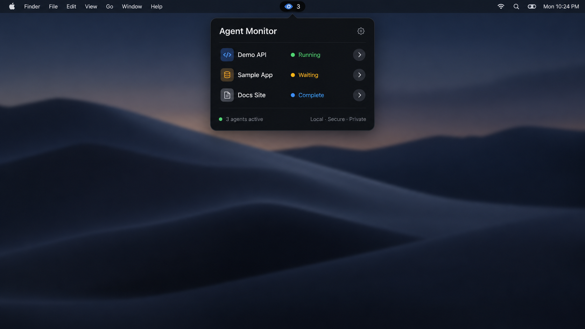

# Agent Monitor

Agent Monitor is an independent Python prototype that shows recent Claude Code
and OpenAI Codex sessions in a small panel at the top of a Mac display. The
working name is deliberately generic and can be replaced after the product is
validated.

The prototype reads local JSONL transcripts and does not send their contents to
any server.



*Privacy-safe product mockup using fictional projects and statuses; it is not
a live session screenshot.*

## Current MVP

- Discovers recent Claude Code sessions under `~/.claude/projects`.
- Discovers recent Codex sessions under `~/.codex/sessions`.
- Prioritizes sessions that are waiting, running, complete, or idle.
- Shows a compact top-center status pill.
- Counts only waiting and running sessions in the compact pill.
- Expands on hover into separate Active and Recent session sections.
- Shows privacy-safe model, branch, token, reason, and activity details when a
  session row is selected.
- Keeps a five-entry, in-memory timeline of observed state changes with their
  timestamp, classification reason, and hook or transcript source.
- Distinguishes thinking, command/tool execution, result processing,
  responding, approval waiting, finished, and idle activity.
- Labels fresh hook evidence Confirmed, fresh transcript evidence Inferred,
  and evidence without an update for two minutes Aging.
- Clicking a mapped session row's terminal arrow focuses its exact iTerm2 tab;
  clicking the row body continues to show privacy-safe details.
- Sends one native notification when a session starts waiting for approval or
  input; notifications can be disabled from the menu-bar menu.
- Plays one standard macOS sound for each new waiting episode. Approval sounds
  have an independent, persistent menu-bar toggle.
- Drops a temporary in-notch banner for new edit, command, permission, or
  input requests and keeps a visible waiting indicator until resolution.
- Accepts sanitized passive lifecycle-hook events from Claude and Codex so
  terminal-only approval prompts can override transcript inference.
- Adds menu-bar actions to refresh, pause monitoring, copy diagnostics, show or
  hide the panel, toggle notifications, and quit.

Permission detection is currently heuristic. Agent Monitor never approves or
executes agent actions.

## Requirements

- macOS
- Python 3.11 or newer
- PyObjC, installed through the project dependencies

Full Xcode is not required for development mode.

## Development setup

```bash
cd agent-monitor
python3 -m venv .venv
source .venv/bin/activate
python -m pip install --upgrade pip
python -m pip install -e '.[dev]'
```

Run the application:

```bash
agent-monitor
```

Inspect the current state classifications without launching the panel:

```bash
agent-monitor --debug
```

Watch live classifications and print a new snapshot only when a session's
state, action, or reason changes:

```bash
agent-monitor --debug --watch
```

## Install the session hooks

Transcript monitoring works without hooks, but terminal focus needs a mapping
between each agent session and its terminal tab. Install the hooks for each
provider you use, after completing the development setup above.

Inspect whether passive live hooks are configured:

```bash
agent-monitor --hooks-status
```

Preview the exact provider configuration fragments without installing them:

```bash
agent-monitor --print-hook-config claude
agent-monitor --print-hook-config codex
```

These commands print JSON only; they do not install anything. Generate the
fragments from the environment you will use to run Agent Monitor: the commands
include the absolute path to that environment's `agent-monitor-hook`.

1. Back up any existing provider configuration before editing it.
2. Merge the Claude fragment into `~/.claude/settings.json`, and the Codex
   fragment into `~/.codex/hooks.json`. Create a missing file using its complete
   fragment. For an existing file, preserve all other settings and append the
   monitor's groups to each event's existing array under `hooks`. Do not replace
   existing hooks or add a second top-level `hooks` key. Skip identical monitor
   entries if they are already installed.
3. In the Codex fragment, set the `SessionEnd` handler's `timeout` to `3`.
   The current generator emits `5`, but Codex permits at most three seconds for
   this event. Other generated timeouts can remain unchanged.
4. Open Codex and use `/hooks` to review and trust the new monitor entries.
   Start or resume a fresh session after trusting them so `SessionStart` can
   create its terminal mapping. Restart or resume Claude sessions as well so
   they load the new configuration.
5. Run `agent-monitor --hooks-status` again. It should report each installed
   provider as configured. This checks configuration references only; it does
   not verify Codex trust, hook execution, or an individual terminal mapping.

For example, if `SessionStart` already has a vault or terminal-status hook,
keep that group and append the monitor's generated `SessionStart` group.
Repeat the merge for the other events in the fragment.

See the [Codex hook reference](https://learn.chatgpt.com/docs/hooks) and
[Claude hook reference](https://code.claude.com/docs/en/hooks) for provider
configuration and lifecycle details.

The generated hooks invoke `agent-monitor-hook`. The bridge always exits
without making an approval decision. It stores only provider, session ID,
project, request category, tool name, and timestamp under
`~/Library/Application Support/Agent Monitor/events`. Commands, diffs, prompts,
responses, and tool output are not retained. Transcript monitoring remains the
fallback when hooks are not installed.

Codex command hooks must be reviewed and trusted with `/hooks` before they can
run. Start a new Codex session after adding or changing `~/.codex/hooks.json`.
Agent Monitor also detects pending `require_escalated` transcript calls so an
already-running local Codex session can still display approval attention.
When Codex reports that an approved command yielded a live process session,
Agent Monitor changes it from waiting approval to running command immediately.
Current Claude Code hooks do not expose a post-approval/tool-start event, so a
Claude command remains waiting until tool completion and its evidence becomes
Aging when no newer signal arrives.

Debug output includes session metadata, derived state explanations, and the
latest classification source, but not transcript message content.

Native notification delivery requires running Agent Monitor as a packaged
macOS application. In source-development mode, macOS identifies the process as
Python and can suppress banners even though notification state is detected.

Move the pointer onto the black status pill at the top center of the display to
open the session list. Clicking a waiting notification opens the expanded
panel. Select a session row to show its derived metadata. Use the menu bar
indicator to refresh, pause or resume monitoring, copy a privacy-safe debug
snapshot, show or hide the panel, toggle notifications or approval sounds, or
quit.

Terminal focus stores only provider/session identifiers, project path, iTerm's
opaque session identifier, and an update timestamp. Mappings expire after seven
days. New or resumed provider sessions capture their mapping through the
passive `SessionStart` hook. macOS may request permission for Python or
Agent Monitor to control iTerm2 the first time its terminal arrow is clicked.

## Keyboard shortcuts

Agent Monitor must be running for these global shortcuts to work.

| Shortcut | Action |
| --- | --- |
| Option + Command + A (`⌥⌘A`) | Show or hide the panel |
| Option + Command + J (`⌥⌘J`) | Focus the terminal of the longest-waiting session |
| Option + Command + P (`⌥⌘P`) | Pause or resume monitoring |

Use Command, not Control. Pressing `⌥⌘A` repeatedly alternates between showing
and hiding the panel. `⌥⌘J` does nothing when no session is waiting; it does not
choose a running session or simply focus the currently selected row. The menu
bar also provides the corresponding actions.

## Troubleshooting terminal focus

If `⌥⌘J` highlights a session in the notch instead of focusing its terminal,
read the message in the session's detail card:

- **Terminal not linked:** install the hooks above, trust them in Codex, and
  restart or resume that agent in its terminal tab. Transcript discovery alone
  cannot establish the tab mapping.
- **Terminal tab unavailable:** the saved tab may have closed or changed.
  Resume the session in the desired terminal tab to refresh its mapping.

Terminal focus supports iTerm2 and Terminal.app. Sessions started in other
terminals or a desktop/IDE agent interface do not get a supported terminal
mapping. If macOS requests Automation permission to control the terminal,
allow it for the Python or Agent Monitor process you launched. Screen Recording
permission is not needed.

To check a specific linked session, click its terminal arrow. To test `⌥⌘J`,
wait for an actual approval or input request in that session, switch to another
app, and press the shortcut. If the menu-bar jump action works but the shortcut
does not, check for another app using the same shortcut and ensure only one
Agent Monitor instance is running.

### Restore after reinstalling macOS or moving the project

Recreate the Python environment and install the dependencies using the setup
steps above. Generate new hook fragments: an old configuration may point to a
previous username, project location, or Python environment. Replace obsolete
Agent Monitor hook entries with the new ones while preserving unrelated hooks,
then review changed Codex entries through `/hooks` and restart or resume your
agent sessions. Reinstalling the monitor alone does not restore terminal
mappings or provider hooks.

## Tests

The parser tests have no runtime dependency on AppKit:

```bash
PYTHONPATH=src python -m unittest discover -s tests -v
```

Lint the project after installing the development dependencies:

```bash
ruff check .
```

## Scope and privacy

Agent Monitor only inspects transcript files on the current Mac. Approval
observability is passive: the app does not approve, deny, execute, or modify
agent requests. State history is bounded per session, stays in memory, and is
cleared whenever Agent Monitor restarts. The MVP does not include analytics,
payments, licence activation, or automatic updates.

This project is an independent implementation. Do not copy branding, source
code, icons, screenshots, or other assets from similarly positioned products.

## License

Agent Monitor is available under the [MIT License](LICENSE).
